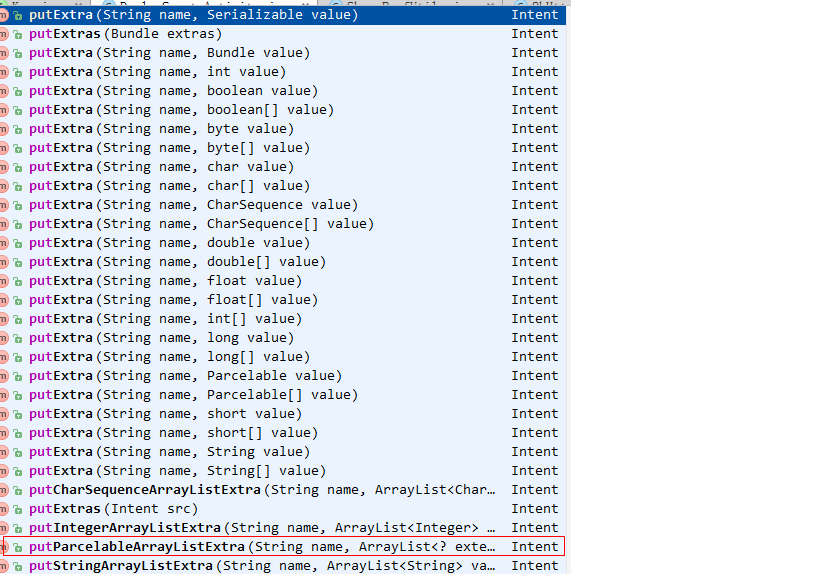

## Activity之间的数据传递

* 传递基本数据类型
* 传递自定义对象
* 传递泛型对象(List)
	
### 传递泛型对象
> 传递自定义对象的list:
* Serializable接口实现:

	public class MyClass implements Serializable{
        private static final long serialVersionUID = 1L;
        public String userName;
        public String psw;
        public int age;
	}
	
	* 发送: intent.putExtra("key", arrayList);  
	* 接收: getIntent().getSerializableExtra("key"); 
	
* Parcelablle接口实现:
	* Parcel类:`http://developer.android.com/reference/android/os/Parcel.html`  封装数据的容器，封装后的数据可以通过Intent或IPC传递  	 
	* Parcelable接口：`http://developer.android.com/reference/android/os/Parcelable.html`  自定义类继承该接口后，其实例化后能够被写入Parcel或从Parcel中恢复。  	 
	* 如果某个类实现了这个接口，那么它的对象实例可以写入到 Parcel 中，并且能够从中恢复，并且这个类必须要有一个 static 的 field ，并且名称要为 CREATOR ，这个 field 是某个实现了 Parcelable.Creator 接口的类的对象实例。
	
			public class MyClass2 implements Parcelable{
		        public String userName;
		        public String psw;
		        public int age;
		        
		        //静态的Parcelable.Creator接口
		        public static final Parcelable.Creator<MyClass2> CREATOR = new Creator<MyClass2>() {
		                
		                //创建出类的实例，并从Parcel中获取数据进行实例化
		                public MyClass2 createFromParcel(Parcel source) {
		                        MyClass2 myClass2 = new MyClass2();
		                        myClass2.userName = source.readString();
		                        myClass2.psw = source.readString();
		                        myClass2.age = source.readInt();
		
		                        return myClass2;
		                }
		
		                public MyClass2[] newArray(int size) {
		                        // TODO Auto-generated method stub
		                        return new MyClass2[size];
		                }
		
		        };
		        
		        //
		        @Override
		        public int describeContents() {
		                // TODO Auto-generated method stub
		                return 0;
		        }
		        
		        //将数据写入外部提供的Parcel中
		        @Override
		        public void writeToParcel(Parcel dest, int flags) {
		                // TODO Auto-generated method stub
		                dest.writeString(userName);
		                dest.writeString(psw);
		                dest.writeInt(age);
		        }
		}