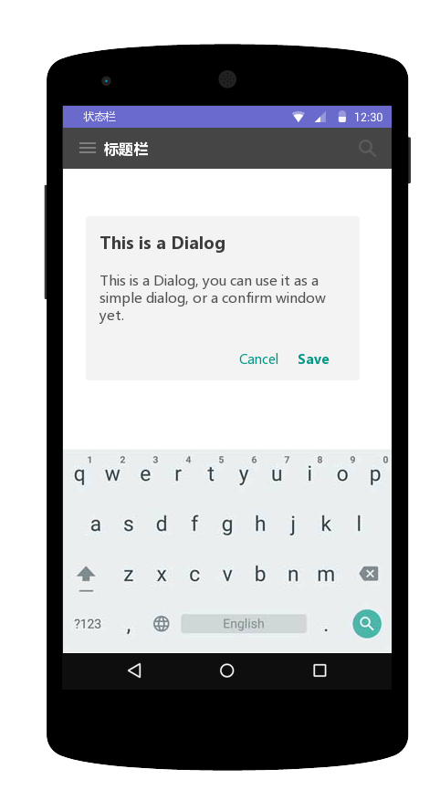
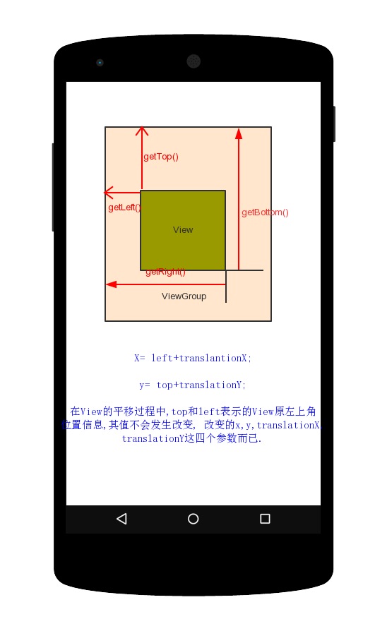
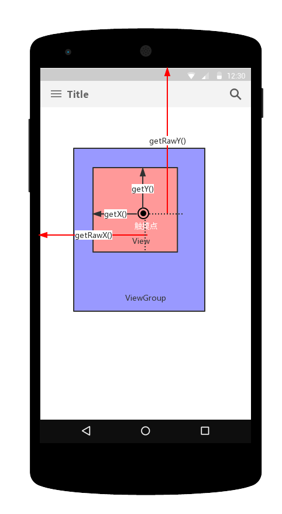
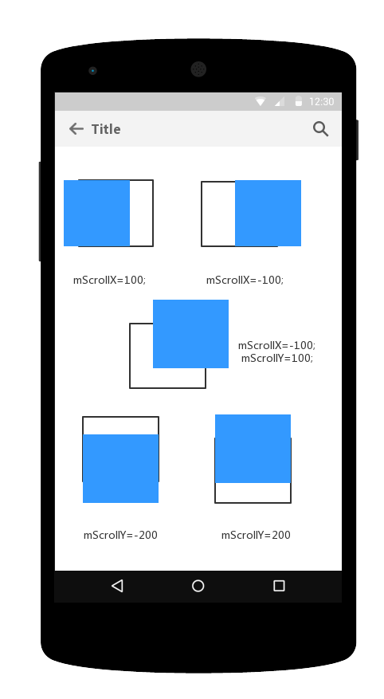
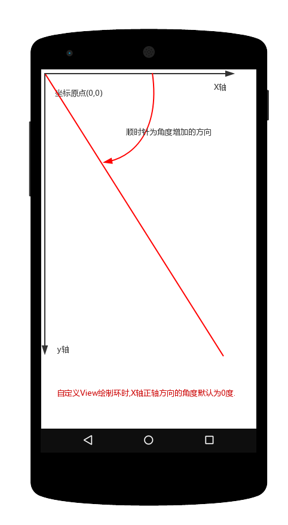

### Android APP屏幕区域划分:



* 1.状态栏区域:

```
		
	//获取屏幕区域的宽高等尺寸获取
	DisplayMetrics metrics = new DisplayMetrics();
	getWindowManager().getDefaultDisplay().getMetrics(metrics);
	int widthPixels = metrics.widthPixels;
	int heightPixels = metrics.heightPixels;

```

* 2. 标题栏区域:

```
	
	//获取状态栏高度
	Rect rect= new Rect();
	getWindow().getDecorView().getWindowVisibleDisplayFrame(rect);
	int statusBarHeight = rectangle.top;
```

* 3. App应用区域(ActionBar区域+View布局区域):

```

	Rect rect = new Rect();
	getWindow().getDecorView().getWindowVisibleDisplayFrame(rect);

```

* 4. RootView布局区域:

```

	/View布局区域宽高等尺寸获取
	Rect rect = new Rect();  
	getWindow().findViewById(Window.ID_ANDROID_CONTENT).getDrawingRect(rect);  

```	

> 注意: 这些方法,最好在onWindowFocusChanged()中调用,才能正确获取相应的值.


### View绝对坐标系



* 从图中很容易得出View的宽高和坐标的关系:

		int width= getRight()-getLeft();
		int height= getBottom()-getTop();

* 从Android3.0开始,View增加了额外的几个参数:`x,y,translationX,translationY`是View左上角相对于父容器的偏移量.

		x= left+ translationX;
		y= top+ translationY;

	> 需要注意点: View在平移的过程中,top和left表示的是View原始左上角的位置信息,其值不会发生改变,改变的是x,y,translationX和translationY的值.

* MotionEvent中的几个方法:
	* getRawX();
	* getRawY();
	* getX();
	* getY();



* View几个与坐标相关的方法:
	* getLocalVisibleRect()
	* getGlobalVisibleRect()
	* getLocationOnScreen()
	* getLocationInWindow()


### View的滑动坐标系:



* View的滑动,可以使用scrollTo()和scrollBy()方法来实现,即滑动过程中View内部参数mScrollX和mScrollY在变化,这两个属性可以通过getScrollX()和getScrollY()来得到(**要注意:scollTo()和scrollBy()只能改变View的内容的位置而不能改变View在布局中的位置**):
	* mScrollX: 总是等于View左边缘和View内容左边缘在水平方向的距离;
	* mScrollY: 总是等于View上边缘和View内容上边缘在竖直方向上的距离;

* View的滑动,其实也可以通过offsetLeftAndRight()和offsetTopAndBottom()方法来实现,这两个方法实际上就是对上下左右移动API方法的封装,最后会调用layout()重新布局实现滑动(**要注意:因为内部调用了layout()重新布局,移动的是整个View,会导致getLeft()等方法结果改变**):

* 综上述说,与View滑动相关的几个方法:
	* getScrollX()
	* getScrollY()
	* scrolTo(int x,int y)
	* scrollBy(int x,int y)
	* offsetLeftAndRight();
	* offsetTopAndBottom();

	
### View的角度问题:




### 和View有关系的几个类:
### ViewConfiguration:
>主要包含一些方法和常量用来设置UI的超时, 大小和距离;

#### MotionEvent:
在手指接触屏幕之后产生的一些列事件中,典型的事件有:

* ACTION_DIWON: 手指触摸到屏幕
* ACTION_MOVE: 手指在屏幕上滑动
* ACTION_UP:手指从屏幕上松开的一瞬间
#### TouchSlop:
> 系统所能识别的被认为是滑动的最小距离.通过ViewConfiguration可以获得实例.

* `ViewConfiguration.get(getContext).getScaledTouchSlop()`来获取滑动距离的临界值,当大于这个值才认为是滑动的.
* 在framework有对这个值定义:
`<dimen mame="config_viewConfigurationTouchSlop">8dp</dimen>`
#### VelocityTracker:
> 速度追踪,用于追踪手指在滑动过程的速度,包括水平和竖直方向的速度

* 先在View的onTouchEvent()中追踪当前单击事件的速度:

		VelocityTracker tracker= VelocityTracker.obtains();
		tracker.addMovement(event);
* 当想知道当前的滑动速度时,可采取如下方法获得当前速度:

		tracker.computeCurrentVelocity(1000);
		int xVelocity = (int)tracker.getXVelocity();
		int yVelocity= (int)tracker.getYVelocity();
* 注意: 获取速度之前,先必须计算速度,即先调用computeXXX();表示一段时间内手指滑过的像素值,如设置时间间隔为1000ms,手指1s内滑过的像素为100,那么速度就为100.速度可以有负值,从右到左滑动即为负值.
* 最后,当不需要使用的时候,可以调研clear方法重置回收:

		tracker.clear();
		tracker.recycle();
#### GestureDetector:
> 手势检测,用于辅助用户单击,滑动,长按,双击等行为

* 先创建一个GestureDetector并实现OnGestureListener接口,根据需要还可以实现OnDoubleTapListener监听双击行为

		GestureDetector detector= new GestureDetector(this);
		//解决长按屏幕后无法拖动的现象
		detector.setIsLongPressEnable(false);
* 接着目标View的onTouchEvent()实现:

		boolean  consume =detector.onTouchEvent(event);	
		return consume;
* 在实际开发中,可以不使用GestureDetector而使用View的onTouchEvent实现逻辑,一般如果只是监听滑动相关的,使用OnTouchEvent()即可,若要监听双击行为,可以使用GestureDetector.
#### Scroller:
> 用于实现View的弹性滑动.当使用View的scrollTo()和scrollBy()进行滑动,其过程是瞬间完成的,体验不好,可以使用Scroller来实现有过渡的滑动效果.

* Scroller本身无法让View弹性滑动,需要和View的computeScroll()配合使用 
	
		Scroller mScroller= new Scroller(this);
		
		private void smoothScrollTo(int destX,int desY){
			int scrollX= getScrollX();
			int delta= desX- srcollX;
			mScroller.startScroll(scrollX,0,delta,0,1000);
			invalidate();
		}
		
		@override
		public void computeScroll(){
			if(scroller.computeScrollOffset()){
				scrollTo(mScrlloer.getCurrX(),mScroller.getCurrY());
				postInvalidate();
		}
#### ViewDragHelper:
