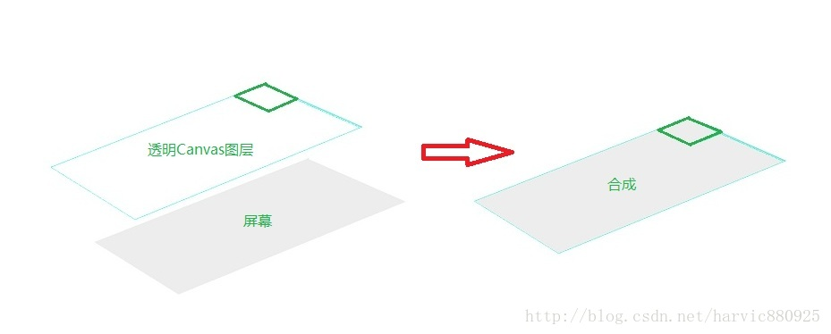
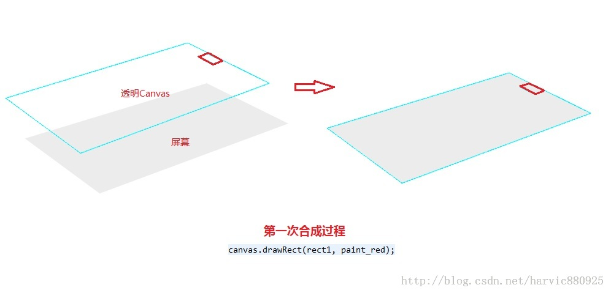
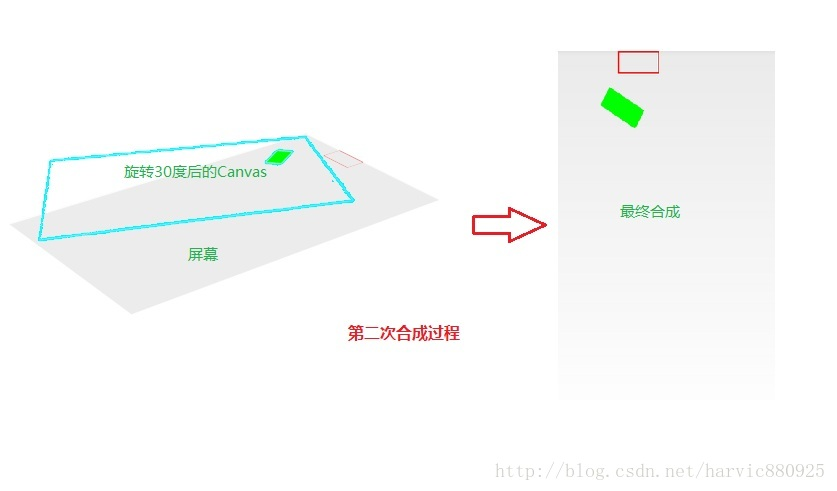
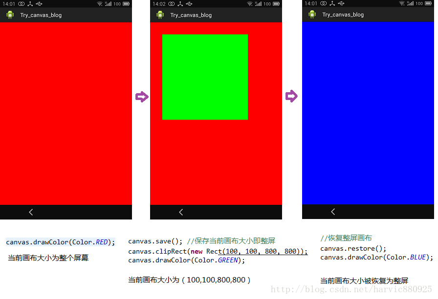

### Canvas的变换与操作

#### canvas与屏幕显示到底是不是一回事?
* 实验代码:绘制一个矩形,再将canvas平移,再绘制一个矩形,两个矩形会不会重合?

	    Rect rect1 = new Rect(0,0,400,220);   
	    canvas.drawRect(rect1, paint_green); 
	    //平移画布后,再用红色边框重新画下这个矩形  
	    canvas.translate(100, 100);  
	    canvas.drawRect(rect1, paint_red);  

* canvas与屏幕显示根本不是一回事,Canvas是个很虚幻的概念,相当于一个透明图层,每次Canvas画图时,即调用Draw系列函数都会产生一个透明图层,然后在这个图层上画画,画完之后覆盖在屏幕上显示.所以上面的两个结果都是由下面几个步骤形成:

*  1) 调用canvas.drawRect(rect1,paint1)时,产生一个Canvas透明图层,由于当时还没有对坐标平移,所以坐标原点还是(0,0),再在屏幕上绘制后再覆盖在屏幕显示出来,过程如下:

* 2)然后第二次调canvas.draw(rect2,paint2)时,又会重新产生一个全新的canvas画布,但是此时画布坐标系已经改变,即向右和向下分别移动了100px,所以此时的绘图方式:合成视图

* 注意: 
	* 1、每次调用canvas.drawXXXX系列函数来绘图进，都会产生一个全新的Canvas画布。

	* 2、如果在DrawXXX前，调用平移、旋转等函数来对Canvas进行了操作，那么这个操作是不可逆的！每次产生的画布的最新位置都是这些操作后的位置。（关于Save()、Restore()的画布可逆问题的后面再讲）
	
	* 3、在Canvas与屏幕合成时，超出屏幕范围的图像是不会显示出来的。

### Canvas的平移(translate)
* 平移方法: **translate函数其实实现的相当于平移坐标系，即平移坐标系的原点的位置**

    	void translate(float x,float y);
* 参数说明：
	* float dx：水平方向平移的距离，正数指向正方向（向右）平移的量，负数为向负方向（向左）平移的量
	* flaot dy：垂直方向平移的距离，正数指向正方向（向下）平移的量，负数为向负方向（向上）平移的量

### Canvas的旋转(rotate)
* 画布的旋转默认是围绕原点来旋转的.
* Roate函数有两个构造:
	* void rotate(float degrees)
		> 旋转的度数，正数是顺时针旋转，负数指逆时针旋转，它的旋转中心点是原点（0，0）
	* void rotate (float degrees, float px, float py)
		> 函数除了度数以外，还可以指定旋转的中心点坐标（px,py）
		
* 实验代码:

		Rect rect1 = new Rect(300,10,500,100);  
	    canvas.drawRect(rect1, paint_red); //画出原轮廓  
	    canvas.rotate(30);//顺时针旋转画布  
	    canvas.drawRect(rect1, paint_green);//画出旋转后的矩形  
* 画布绘制过程:

### Canvas的缩放

* 画布的缩放默认也是绕原点缩放
* Scale的两个函数:
	* public void scale (float sx, float sy)
		> x方向上的缩放比例, y方向上的缩放比例
	* public final void scale (float sx, float sy, float px, float py)
		> 不仅提供缩放比例,还提供绕哪个中心点坐标缩放
		
### Canvs的扭曲(Skew)
* 扭曲(斜切)函数:
	void skew (float sx, float sy)
* 参数说明:
	* float sx:将画布在x方向上倾斜相应的角度，sx倾斜角度的tan值，
	* float sy:将画布在y轴方向上倾斜相应的角度，sy为倾斜角度的tan值，

### Canvas裁剪(clip)
* 画布裁剪是利用clip函数与Rect,path,Region取交,并,差等集合运算出来获得最新画布的形状. 除了调用save(),restore()函数以外,这些操作都是不可逆的,一旦Canvas被裁剪就不可逆了,就不能再被恢复.

* Clip系列函数如下：
	* `boolean	clipPath(Path path)`
	* `boolean	clipPath(Path path, Region.Op op)`
	* `boolean	clipRect(Rect rect, Region.Op op)`
	* `boolean	clipRect(RectF rect, Region.Op op)`
	* `boolean	clipRect(int left, int top, int right, int bottom)`
	* `boolean	clipRect(float left, float top, float right, float bottom)`
	* `boolean	clipRect(RectF rect)`
	* `boolean	clipRect(float left, float top, float right, float bottom, Region.Op op)`
	* `boolean	clipRect(Rect rect)`
	* `boolean	clipRegion(Region region)`
	* `boolean	clipRegion(Region region, Region.Op op)`

### Canvas的保存与恢复

* ` save（）：`
	> 每次调用Save（）函数，都会把当前的画布的状态进行保存，然后放入特定的栈中；
	
* `restore（）：`
	> 每当调用Restore（）函数，就会把**`栈中最顶层的画布`**状态取出来，并按照这个状态恢复当前的画布，并在这个画布上做画。

* 实例代码:

		canvas.drawColor(Color.RED);  
	    //保存当前画布大小即整屏  
	    canvas.save();   
	    canvas.clipRect(new Rect(100, 100, 800, 800));  
	    canvas.drawColor(Color.GREEN);  
	    //恢复整屏画布  
	    canvas.restore();   
	    canvas.drawColor(Color.BLUE);  
* 图像合成过程:

