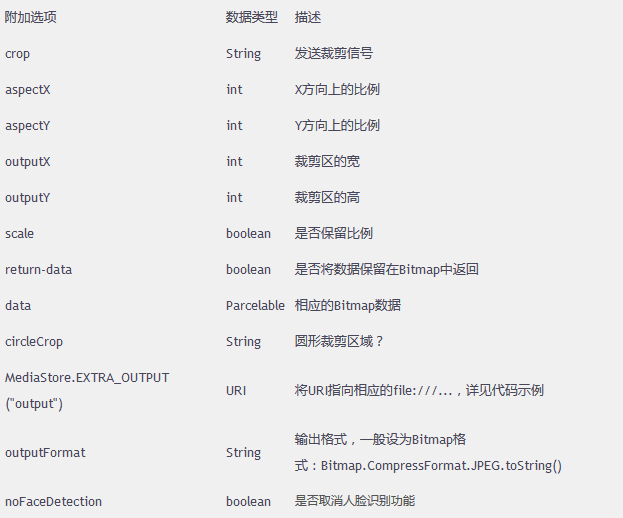

## 相册裁剪
--
### 一.基础讲解:
使用拍照和裁剪一般使用系统自带的Intent来实现(源码?)

* 拍照 `MediaStore.ACTION_IMAGE_CAPTURE`

	`public static final java.lang.String ACTION_IMAGE_CAPTURE = "android.media.action.IMAGE_CAPTURE"`

* 启动相册:`Intent.ACTION_GET_CONTENT`
	
	`public static final java.lang.String ACTION_GET_CONTENT = "android.intent.action.GET_CONTENT"`

* 启动裁剪: `com.android.camera.action.CROP `
	使用裁剪的功能通过intent.putExtra("key","value")实现.

	>注意: return-data如果设置为true,对应有些手机只会得到缩略图,一般设置为false,一直用URI来输出.而URI在有些手机上也会有问题.

* 权限:

	    <uses-permission android:name="android.permission.WRITE_EXTERNAL_STORAGE" />  
    	<uses-permission android:name="android.permission.MOUNT_UNMOUNT_FILESYSTEMS" />

### 二.仅仅启动相册
* 启动相册Action:

		public static final java.lang.String ACTION_GET_CONTENT = "android.intent.action.GET_CONTENT"`
* 隐式启动相册代码:

		Intent intent = new Intent(Intent.ACTION_GET_CONTENT, null);  
	    intent.setType("image/*");  
	    startActivityForResult(intent,RESULT_ALBUM_ONLY_THROUGH_DATA);

* 开启相册,选择图片,接收结果:
	
		//使用return-data为false的效果,但bitmap超过1M时,data传递失败,显示缩略图
	    protected void onActivityResult(int requestCode, int resultCode, Intent data) {  
	        super.onActivityResult(requestCode, resultCode, data);  
	        if (resultCode != Activity.RESULT_OK) {  
	            return;  
	        }  
	        switch (requestCode) {  
	            case RESULT_ALBUM_ONLY_THROUGH_DATA: {  
	                //照片的原始资源地址  
	                try {  
	                    //使用ContentProvider通过URI获取原始图片  
	                    Bitmap photo = MediaStore.Images.Media.getBitmap(getContentResolver(), data.getData());  
	                    if (photo != null) {  
	                        Bitmap smallBmp = setScaleBitmap(photo, 2);  
	                        mImageView.setImageBitmap(smallBmp);  
	                    }  
	                } catch (FileNotFoundException e) {  
	                    e.printStackTrace();  
	                } catch (IOException e) {  
	                    e.printStackTrace();  
	                }  
	            }  
	            break;  
	        }  
	    }  

### 三. 从相册选取并裁剪(通过URI返回)
* 启动相册,选择图片,直接裁剪

		Intent intent = new Intent(Intent.ACTION_GET_CONTENT, null);  
	    intent.setType("image/*");  
	    intent.putExtra("crop", "true");  
	    intent.putExtra("aspectX", 1);  
	    intent.putExtra("aspectY", 1);  
	    intent.putExtra("outputX", 1000);  
	    intent.putExtra("outputY", 1000);  
	    intent.putExtra("scale", true);  
	    intent.putExtra("return-data", false);  
	    intent.putExtra(MediaStore.EXTRA_OUTPUT, imageUri);  
	    intent.putExtra("outputFormat", Bitmap.CompressFormat.JPEG.toString());  
	    intent.putExtra("noFaceDetection", true);  
	    startActivityForResult(intent, RESULT_ALBUM_CROP_URI);  
* 接收结果:

		protected void onActivityResult(int requestCode, int resultCode, Intent data) {  
	        super.onActivityResult(requestCode, resultCode, data);  
	        if (resultCode != Activity.RESULT_OK) {  
	            return;  
	        }  
	        switch (requestCode) {  
	            case RESULT_ALBUM_CROP_URI: {  
	                try {  
	                    Bitmap bitmap = BitmapFactory.decodeStream(getContentResolver().openInputStream(imageUri));  
	                    if (bitmap != null) {  
	                        Bitmap smallBmp = setScaleBitmap(bitmap, 2);
							//和拍照一样,手机上也是显示不出来  
	                        mImageView.setImageBitmap(smallBmp);  
	                    }  
	                } catch (Exception e) {  
	                    e.printStackTrace();  
	                }  
	            }  
	            break;  
	        }  
	    }  

### 正确的方案:
通过传递intent的data域返回的URI,找到图片的地址:

		 // 解析获取图片库图片Uri物理路径  
	     public static String parsePicturePath(Context context, Uri uri) {  
	      
	         if (null == context || uri == null)  
	             return null;  
	      
	         boolean isKitKat = Build.VERSION.SDK_INT >= Build.VERSION_CODES.KITKAT;  
	         // DocumentUri  
	         if (isKitKat && DocumentsContract.isDocumentUri(context, uri)) {  
	             // ExternalStorageDocumentsUri  
	             if (isExternalStorageDocumentsUri(uri)) {  
	                 String docId = DocumentsContract.getDocumentId(uri);  
	                 String[] splits = docId.split(":");  
	                 String type = splits[0];  
	                 if ("primary".equalsIgnoreCase(type)) {  
	                     return Environment.getExternalStorageDirectory() + File.separator + splits[1];  
	                 }  
	             }  
	             // DownloadsDocumentsUri  
	             else if (isDownloadsDocumentsUri(uri)) {  
	                 String docId = DocumentsContract.getDocumentId(uri);  
	                 Uri contentUri = ContentUris.withAppendedId(Uri.parse("content://downloads/public_downloads"), Long.valueOf(docId));  
	                 return getDataColumn(context, contentUri, null, null);  
	             }  
	             // MediaDocumentsUri  
	             else if (isMediaDocumentsUri(uri)) {  
	                 String docId = DocumentsContract.getDocumentId(uri);  
	                 String[] split = docId.split(":");  
	                 String type = split[0];  
	                 Uri contentUri = null;  
	                 if ("image".equals(type)) {  
	                     contentUri = MediaStore.Images.Media.EXTERNAL_CONTENT_URI;  
	                 } else if ("video".equals(type)) {  
	                     contentUri = MediaStore.Video.Media.EXTERNAL_CONTENT_URI;  
	                 } else if ("audio".equals(type)) {  
	                     contentUri = MediaStore.Audio.Media.EXTERNAL_CONTENT_URI;  
	                 }  
	                 String selection = "_id=?";  
	                 String[] selectionArgs = new String[] {split[1]};  
	                 return getDataColumn(context, contentUri, selection, selectionArgs);  
	             }  
	         }  
	         // MediaStore (general)  
	         else if ("content".equalsIgnoreCase(uri.getScheme())) {  
	             if (isGooglePhotosContentUri(uri))  
	                 return uri.getLastPathSegment();  
	             return getDataColumn(context, uri, null, null);  
	         }  
	         // File  
	         else if ("file".equalsIgnoreCase(uri.getScheme())) {  
	             return uri.getPath();  
	         }  
	         return null;  
	      
	     }  

### 终极方案(相册裁剪)
* 开启相册
	
		Intent intent = new Intent(Intent.ACTION_GET_CONTENT, null);  
		intent.setType("image/*");  
		startActivityForResult(intent, RESULT_ALBUM_CROP_PATH); 
* 接收时找到图片的路径,生成对应的URI,转给裁剪页面:

		protected void onActivityResult(int requestCode, int resultCode, Intent data) {  
	    	super.onActivityResult(requestCode, resultCode, data);  
	    	if (resultCode != Activity.RESULT_OK) {  
	        	return;  
	    	}  
	    	switch (requestCode) {  
	        	case RESULT_ALBUM_CROP_PATH:{  
	            	String picPath = parsePicturePath(MyActivity.this,data.getData());  
	            	File file = new File(picPath);  
	            	Uri uri = Uri.fromFile(file);  
	            	cropImg(uri);  
	        	}  
	        	break;  
	    	}  
		} 
* 裁剪代码:
	
		public void cropImg(Uri uri) {  
	    	File tempFile = getTempFile();  
	    	Intent intent = new Intent("com.android.camera.action.CROP");  
	    	intent.setDataAndType(uri, "image/*");  
	    	intent.putExtra("crop", "true");  
	    	intent.putExtra("aspectX", 1);  
	    	intent.putExtra("aspectY", 1);  
	    	intent.putExtra("outputX", 700);  
	    	intent.putExtra("outputY", 700);  
	    	intent.putExtra("return-data", false);  
	    	intent.putExtra(MediaStore.EXTRA_OUTPUT, Uri.fromFile(tempFile));  
	    	intent.putExtra("outputFormat", Bitmap.CompressFormat.JPEG.toString());  
	    	intent.putExtra("noFaceDetection", true);  
	    	startActivityForResult(intent, RESULT_CAMERA_CROP_PATH_RESULT);  
		} 
* 裁剪图片后,将结果保存到暂存的本地图片URI中,然后在接收result时,将保存在本地的图片取出,设置到imageview上,为防止显示不出来,将其缩小到1/2;
		
		/*cropImg(Uri uri)中，我们设置了MediaStore.EXTRA_OUTPUT参数，即我们已经将结果转成URI，输出到
		* tempFile中去了，所以在Intent的Data域可能就没有值了；（极少个别机型会出现），所以正确的接收方式应该为：
		* 即直接从TempFile中获取当前保存的图片
		*/
		protected void onActivityResult(int requestCode, int resultCode, Intent data) {  
		    super.onActivityResult(requestCode, resultCode, data);  
		    if (resultCode != Activity.RESULT_OK) {  
		        return;  
		    }  
		    switch (requestCode) {  
		        case RESULT_CAMERA_CROP_PATH_RESULT: {  
		            if (getTempFile() != null) {  
	                Bitmap bitmap = BitmapFactory.decodeFile(getTempFile().getAbsolutePath(), null);  
	                	if (bitmap != null) {  
	                    	Bitmap smallBmp = setScaleBitmap(bitmap, 2);  
	                    	mImageView.setImageBitmap(smallBmp);  
	                }  
	            }   
		        }  
		        break;  
		    }  
		} 

### 最优方案:

* 启动相册:

		Intent intent = new Intent(Intent.ACTION_GET_CONTENT, null);  
		intent.setType("image/*");  
		startActivityForResult(intent, RESULT_ALBUM_ONLY_THROUGH_URI); 

* 接收结果:

		protected void onActivityResult(int requestCode, int resultCode, Intent data) {  
	        super.onActivityResult(requestCode, resultCode, data);  
	        if (resultCode != Activity.RESULT_OK) {  
	            return;  
	        }  
	        switch (requestCode) {  
	            case RESULT_ALBUM_ONLY_THROUGH_URI: {  
	                try {  
	                    String picPath = parsePicturePath(MyActivity.this, data.getData());  
	                    File file = new File(picPath);  
	                    Uri uri = Uri.fromFile(file);  
	                    Bitmap photo = MediaStore.Images.Media.getBitmap(getContentResolver(), uri);  
	                    if (photo != null) {  
	                        Bitmap smallBmp = setScaleBitmap(photo, 2);  
	                        mImageView.setImageBitmap(smallBmp);  
	                    }  
	                } catch (Exception e) {  
	                    e.printStackTrace();  
	                }  
	            }  
	            break;  
	        }  
	    }  